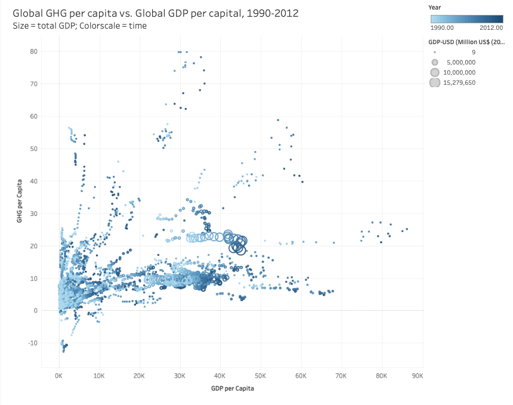

# Examining the Correlation Between GDP per Capita and Greenhouse Gas Emissions per Capita

 

View the [Tableau Visualization](https://public.tableau.com/profile/mark.sutton#!/vizhome/GHGProject-StoryOct26/Story1?publish=yes) of the data

View the <a href="https://docs.google.com/presentation/d/17-YfukfQGN5UGRZPcsuZG0c2pppAplVxiQyVRQKYgZc/edit?usp=sharing" target="_blank">Presentation</a> (right-click to open in new tab)

# Background

Countries have two goals that may seem to be in conflict. One is economic -- increase Gross Domestic Product (GDP); and a second is environmental -- reduce greenhouse gas emissions (GHG). Is it possible for countries to do both of these simultaneously? First, we created [an interactive dashboard](https://ghg-gdp-analyzer.herokuapp.com/) that is able to estimate the amount of metric tons of greenhouse gases an individual will emit based on their GDP per capita. We used data from [World Resouces Institute](https://datasets.wri.org/dataset/cait-country) which had data for 187 country's GDP, population, and greenhouse gas emessions from 1990-2012. We were able to create a model based on this data and forecast what an indvidual's estimated GHG emissions are based on a user-inputted GDP per capita. On the site, we also embedded the [Tableau Visualization](https://ghg-gdp-analyzer.herokuapp.com/visualizations/ghg_per_capita) in a separate HTML page.

# Tools Used
* Python
* HTML
* Flask
* Tableau 
* Javascript
* Heroku

# Process
The first step was to clean and fill in any missing data points from the data set. Some countries (mostly Soviet era countries) were missing GDP data so those points had to be entered manually. Once the data set was cleaned, the data was loaded into Juypter Notebook and a script was created to make a machine learning model (figure 1) that can accurately predict an individual's GHG emmissions based on an inputed GDP per capita. Then, using flask, heroku, and javascript we deployed the machine learning model to a webpage. This webpage also includes Tableau visualizations (figure 2) that show trends within the dataset, as well as global map visualizations. 

# Figure 1:

 

# Figure 2: 

 

# Figure 3: 

 

# Results
Our Tableau visualizations provided an easy and unique way to find trends within our data. Figure 2 is a dashboard showing high emitters, high GDP countries, global trends, and and interactive look over time. In figure 4, there is some pretty distinct groupings of countries. One example of this group is the oil producing countries of the Middle East. Those countries were generally grouped in the top right of the graph showing they have a high green house gas emission as well as a higher GDP level. The Northern European countries were mostly grouped at the bottom right of the graph indicating they maintain a high GDP per capita while also having very low emission levels. One country, Bhutan, is the only country in the world that is carbon negative, meaning their green house gas emissions are in the negative due to forests which are carbon sinks. In our data set, there was a few other countries that were in the negatives (ex. Serbia) but upon further research, we believed the data set we used had faulty numbers and outside research confirmed that. 

# Figure 4: 

 

# Potential Next Steps  
* Breakdown world power country's GHG emissions further and discover which industries whithin these countries are resposible for how much of the total emissions a country. This would show exactly where each country can improve/work on reducing their emissions. 
* Include population growth into our analysis somehow. 
* Updating the value of the dollar from 2005 to the current years value. 
* Updating the data to include the last 8 years. 
